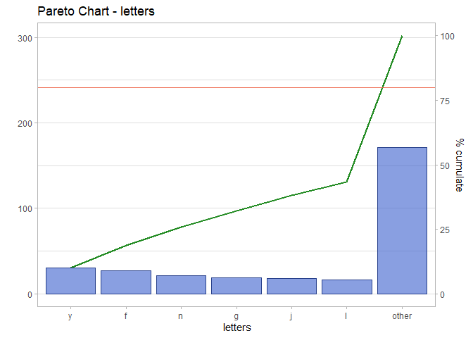
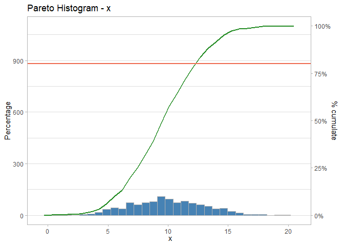
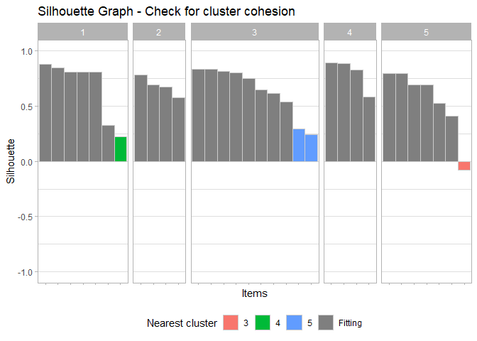

<!-- README.md is generated from README.Rmd. Please edit that file -->

# ggfancy

The goal of ggfancy is to create clean and helpful ggplots.

## Installation

You can install the development version from
[GitHub](https://github.com/) with:

``` r
# install.packages("devtools")
devtools::install_github("edo91/prettifier")
```

## Example

This is a basic example which shows you how to solve a common problem:

``` r
library(ggfancy)
#> Registered S3 method overwritten by 'GGally':
#>   method from   
#>   +.gg   ggplot2
## basic example code
```

### Pareto Chart

``` r
test <- dplyr::sample_n(tibble::tibble(letters = letters),100, replace=TRUE)
test$frequency <- round(runif(100, 1, 5),0)
plot_pareto(test, letters, frequency, group_over = 6)
```



### Pareto Histogram

``` r
test <- data.frame(x = rnorm(1100, 10, 3), g = letters[1:5])
plot_pareto_histogram(test, x)
```



``` r
plot_pareto_histogram_facet(test, x, g)
```


### Heatmap

``` r
plot_heatmap(iris)
```


``` r

x <- tibble::as_tibble(setNames(purrr::rerun(6,
                                             sample(c(1:10,NA), 
                                                    100,
                                                    replace = TRUE)),
                                letters[1:6]))

plot_na(x)
```


### Waterfall

``` r

aa <- tibble::tribble(
  ~ group  , ~ label      , ~ value,
  "season1", "loss"       ,     -20,
  "season1", "new"        ,      30,
  "season1", "gain"       ,      40,
  "season2", "loss"       ,     -15,
  "season2", "gain"       ,      25,
  "season3", "loss"       ,     -10,
  "season3", "disappeared",     -15,
  "season3", "gain"       ,       5
  
)

starting_point <- 100

plot_waterfall(aa, starting_point)
```


### ScatterMatrix

``` r
plot_scattermatrix(iris)
#> `geom_smooth()` using formula 'y ~ x'
#> `geom_smooth()` using formula 'y ~ x'
#> `geom_smooth()` using formula 'y ~ x'
#> `geom_smooth()` using formula 'y ~ x'
#> `geom_smooth()` using formula 'y ~ x'
#> `geom_smooth()` using formula 'y ~ x'
#> `stat_bin()` using `bins = 30`. Pick better value with `binwidth`.
#> `stat_bin()` using `bins = 30`. Pick better value with `binwidth`.
#> `stat_bin()` using `bins = 30`. Pick better value with `binwidth`.
#> `stat_bin()` using `bins = 30`. Pick better value with `binwidth`.
```


### Silhoutte

``` r
kcl <- kmeans(mtcars, centers = 5, nstart = 50)
dis <- dist(mtcars)^2
plot_silhouette(v_clusters = kcl$cluster, mx_dist = dis, threshold = 0.3)
```


